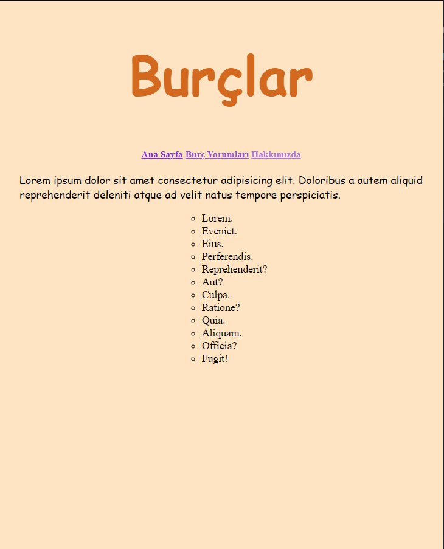

# CSS Ödev 1
---

Bu ödevde sizlerden istediğimiz hayal gücünüzü kullanarak öğrendiğiniz ve araştırarak bulduklarınızla birlikte güzel bir site oluşturmanız. Burada oluşturduğumuz sitenin tasarımı hoşunuza gitmese dahi burada önemli olan nokta CSS elemanlarını efektif bir şekilde kullanabiliyor muyuz onu görmek. Tasarımı ilerleyen ödevlerde daha güzelleştireceğiz.

---

### Yaptığım Ödevin Ana Sayfası

